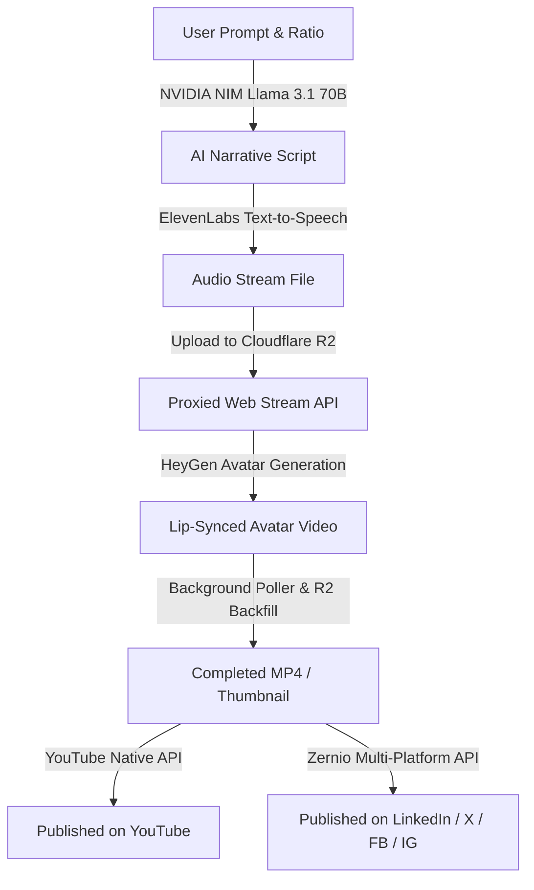

# SCRIPT-AI (ScriptForge) Architecture & Reference Guide

This document provides a comprehensive overview of how **SCRIPT-AI** works, its Next.js workspace structure, page routing, database schemas, and integration pipelines.

---

## 📂 Project Structure & Layout

The project is structured as a modern **Next.js 14** application with App Router, TypeScript, Prisma ORM, and Tailwind CSS.

```text
SCRIPT-AI/
├── prisma/
│   └── schema.prisma         # PostgreSQL / Supabase Schema Definition
├── src/
│   ├── app/
│   │   ├── api/              # Backend REST API endpoints (Next.js Route Handlers)
│   │   │   ├── api-keys/     # SCRIPT-AI developer keys
│   │   │   ├── audio/        # Proxied TTS audio streaming for HeyGen
│   │   │   ├── auth/         # NextAuth credentials & Google login setup
│   │   │   ├── generate/     # NVIDIA NIM, ElevenLabs, and HeyGen triggers
│   │   │   ├── publish/      # Connected accounts and social uploads
│   │   │   ├── social/       # Zernio OAuth connection callback & webhook receivers
│   │   │   └── ...           # Project management, user settings, video lists
│   │   ├── layout.tsx        # Global layout configuration
│   │   └── page.tsx          # Main entrypoint / Dashboard Workspace SPA
│   ├── components/           # React component layer
│   │   ├── ProjectPipeline.tsx  # 4-Step Interactive Video Generation Wizard
│   │   ├── PublishSection.tsx   # Social Connection Dashboard & History Grid
│   │   ├── VideoLibrary.tsx     # Player & storage downloader
│   │   ├── SettingsSection.tsx  # Avatar presets, profile info & dark mode
│   │   ├── ApiKeysSection.tsx   # Provider Keys configuration panel
│   │   ├── AuthScreen.tsx       # SignIn/SignUp screen
│   │   └── ui/                  # Reusable UI primitives (Button, Card, Input)
│   ├── hooks/                # Custom React hooks (Query & Mutations)
│   ├── lib/                  # Utilities (Encryption, Cloudflare R2 client, env helpers)
│   │   ├── publishers/       # Zernio and YouTube publishing engines
│   │   └── zernio/           # Lazily-initialized Zernio client sdk wrapper
│   ├── services/             # Dynamic integration services
│   └── store/
│       └── store.ts          # Zustand ephemeral state (Active tabs, prefilled data)
```

---

## 🔄 Core Working Workflow

SCRIPT-AI converts a simple text prompt into a fully voiced, lip-synced video avatar and automates its distribution across social networks.



### 1. Script Generation (Stage 1 & 2)
- The user inputs a video prompt, selects an aspect ratio (`16:9`, `9:16`, `1:1`), and requests a script.
- SCRIPT-AI calls the **NVIDIA NIM API** (running **Llama 3.1 70B Instruct**), returning an engaging script formatted for vertical or widescreen delivery.

### 2. Voice Generation (Stage 3)
- The script is dispatched to **ElevenLabs TTS**. SCRIPT-AI records the audio stream, uploads the buffer to **Cloudflare R2**, and exposes it via `/api/audio/[voiceId]` so third-party renderers can access the asset.

### 3. Video Synthesis (Stage 4)
- The user selects a digital avatar and triggers video generation.
- SCRIPT-AI calls **HeyGen's API** to synthesize an avatar video. It feeds HeyGen the avatar ID and the proxied audio URL from `/api/audio/[voiceId]`.
- A background worker (`/api/generate/video/status`) polls HeyGen. Once completed:
  1. The raw MP4 and thumbnail are downloaded from HeyGen.
  2. The media is stored persistently in **Cloudflare R2**.
  3. Pre-signed URLs (24-hour expiration) are written to **Supabase PostgreSQL** and sent to the client.

### 4. Unified Social Publishing
- **YouTube**: Authorized natively via a direct Google OAuth flow. Uploads use the official Google APIs client.
- **LinkedIn, Facebook, Instagram, and X (Twitter)**: Authenticated and published using the **Zernio API**.
- A secure webhook endpoint (`/api/social/webhook`) verifies timing-safe signature headers (`X-Zernio-Signature`) using HMAC-SHA256 and updates distribution status in real-time.

---

## 🖥️ Page & View Structure (Single Page Workspace)

The frontend operates as a single page dashboard workspace where views are swapped dynamically via Zustand tab routing:

1. **Dashboard** (`dashboard`): Provides rapid statistics, recent logs, template recommendations, and recent video lists.
2. **Projects** (`projects`): Workspace to manage draft, generating, or completed creations.
3. **Templates** (`templates`): Prefills aspect ratios, voices, and creative prompts for various niches (Marketing, YouTube Shorts, Explainer).
4. **Pipeline** (`pipeline`): The interactive wizard walkthrough for individual video projects.
5. **Video Library** (`video-library`): Shows fully rendered projects with sharing buttons, downloads, and playback.
6. **Publish** (`publish`): Social media accounts manager (connect/disconnect buttons, channel statistics) and published items log.
7. **API Keys** (`api-keys`): Panel to add user-specific API keys (NVIDIA, ElevenLabs, HeyGen) which are encrypted before storage.
8. **Settings** (`settings`): Profile, default presets, and visual theme selection.

---

## 🗄️ Database Schema Reference (Prisma Models)

The data model uses PostgreSQL with CUID identifiers. Encrypted fields protect personal keys.

### Core Schemas

#### User & Authentication
- `User`: Core account record. Connected to NextAuth accounts/sessions and API credentials.
- `Account`: Google OAuth tokens and linking metadata.
- `Session`: Express NextAuth logins.
- `UserSettings`: General custom presets (default language, default duration, visual theme).

#### Video Generation Pipeline
- `Project`: Tracks the pipeline progression (`IDEA`, `SCRIPT`, `VOICE`, `VIDEO`) and status (`DRAFT`, `SCRIPTING`, `VOICING`, `GENERATING`, `COMPLETED`, `FAILED`). Stores current prompt parameters.
- `Script`: Historic text entries generated by Llama 3.1.
- `Voice`: Voice files created by ElevenLabs, pointing to R2 file paths.
- `Video`: Fully processed avatar videos, dimensions, durations, and thumbnail locations in R2.
- `GenerationHistory`: Flexible JSON tracking logs for token accounting, durations, and request-response cycles.

#### Social Publishing
- `SocialAccount`: Connected distribution targets. 
  - YouTube accounts store Google tokens.
  - Non-YouTube platforms use Zernio integration fields (`zernioAccountId` and `accountHandle`).
- `PublishedVideo`: Tracks individual uploads, external post IDs, platforms, error logs, and watch links.

#### Developer Integrations
- `ProviderKey`: Secure AES-GCM encrypted API keys for NVIDIA, ElevenLabs, and HeyGen.
- `ApiKey`: Custom SHA-256 hashed keys authorizing external developers to access SCRIPT-AI endpoints.
